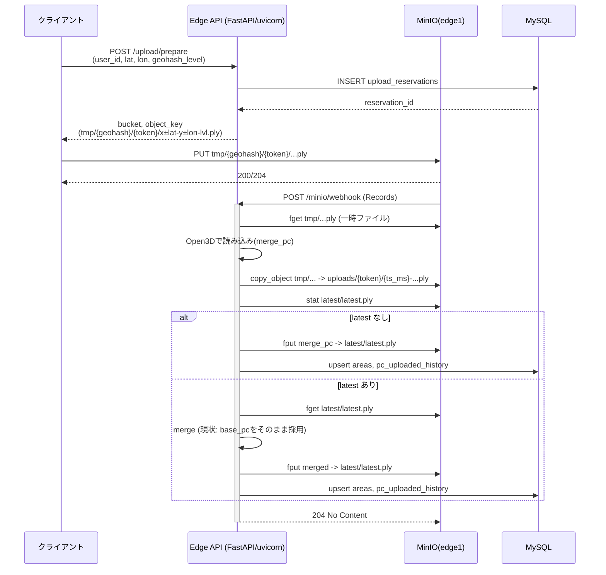

```mermaid
sequenceDiagram
    participant クライアント
    participant EdgeAPI as Edge API (FastAPI/uvicorn)
    participant MinIO as MinIO(edge1)
    participant DB as MySQL

    %% アップロード予約
    クライアント->>EdgeAPI: POST /upload/prepare<br/>(user_id, lat, lon, geohash_level)
    EdgeAPI->>DB: INSERT upload_reservations
    DB-->>EdgeAPI: reservation_id
    EdgeAPI-->>クライアント: bucket, object_key<br/>(tmp/{geohash}/{token}/x±lat-y±lon-lvl.ply)

    %% 点群アップロード
    クライアント->>MinIO: PUT tmp/{geohash}/{token}/...ply
    MinIO-->>クライアント: 200/204

    %% Webhook 通知
    MinIO->>EdgeAPI: POST /minio/webhook (Records)

    activate EdgeAPI
    EdgeAPI->>MinIO: fget tmp/...ply (一時ファイル)
    EdgeAPI->>EdgeAPI: Open3Dで読み込み(merge_pc)

    %% 履歴保存
    EdgeAPI->>MinIO: copy_object tmp/... -> uploads/{token}/{ts_ms}-...ply

    %% latest 更新
    EdgeAPI->>MinIO: stat latest/latest.ply
    alt latest なし
        EdgeAPI->>MinIO: fput merge_pc -> latest/latest.ply
        EdgeAPI->>DB: upsert areas, pc_uploaded_history
    else latest あり
        EdgeAPI->>MinIO: fget latest/latest.ply
        EdgeAPI->>EdgeAPI: merge (現状: base_pcをそのまま採用)
        EdgeAPI->>MinIO: fput merged -> latest/latest.ply
        EdgeAPI->>DB: upsert areas, pc_uploaded_history
    end
    EdgeAPI-->>MinIO: 204 No Content
    deactivate EdgeAPI
```
