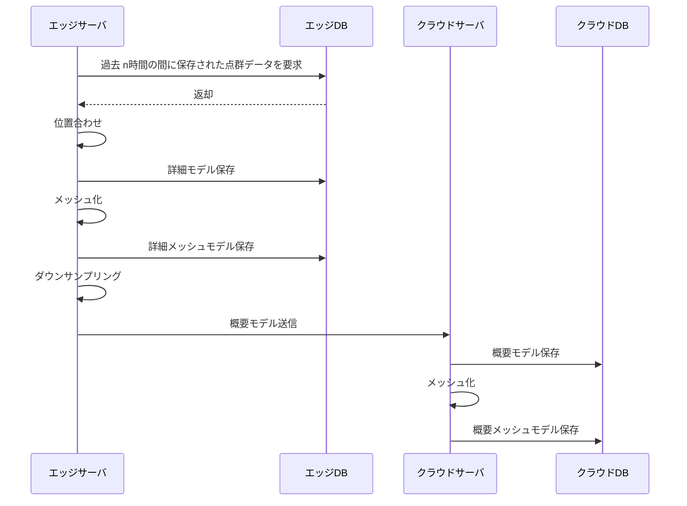

```mermaid
sequenceDiagram
    participant EdgeSrv    as エッジサーバ  
    participant EdgeDB      as エッジDB
    participant CloudSrv    as クラウドサーバ
    participant CloudDB      as クラウドDB

    EdgeSrv->>EdgeDB: 過去 n時間の間に保存された点群データを要求
    EdgeDB-->>EdgeSrv: 返却
    EdgeSrv->>EdgeSrv: 位置合わせ
    EdgeSrv->>EdgeDB: 詳細モデル保存
    EdgeSrv->>EdgeSrv: メッシュ化
    EdgeSrv->>EdgeDB: 詳細メッシュモデル保存
    EdgeSrv->>EdgeSrv: ダウンサンプリング
    EdgeSrv->>CloudSrv: 概要モデル送信
    CloudSrv->>CloudDB: 概要モデル保存
    CloudSrv->>CloudSrv: メッシュ化
    CloudSrv->>CloudDB: 概要メッシュモデル保存
```
