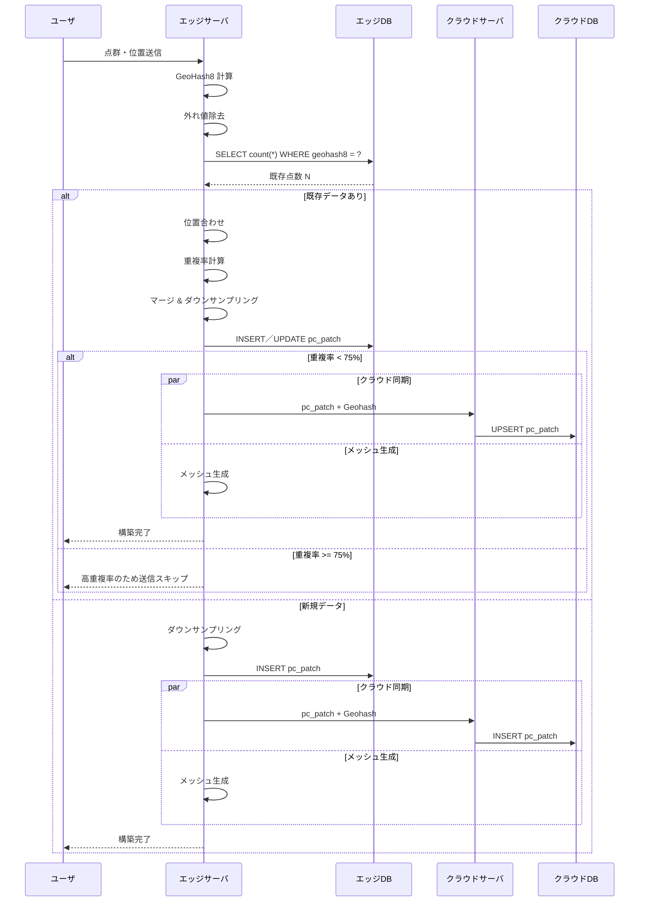

```mermaid
sequenceDiagram
    participant User        as ユーザ
    participant EdgeSrv    as エッジサーバ
    participant EdgeDB      as エッジDB
    participant CloudSrv    as クラウドサーバ
    participant CloudDB     as クラウドDB

    User->>EdgeSrv: 点群・位置送信

    EdgeSrv->>EdgeSrv: GeoHash8 計算
    EdgeSrv->>EdgeSrv: 外れ値除去

    EdgeSrv->>EdgeDB: SELECT count(*) WHERE geohash8 = ?
    EdgeDB-->>EdgeSrv: 既存点数 N

    alt 既存データあり
        EdgeSrv->>EdgeSrv: 位置合わせ
        EdgeSrv->>EdgeSrv: 重複率計算
        EdgeSrv->>EdgeSrv: マージ & ダウンサンプリング
        EdgeSrv->>EdgeDB: INSERT／UPDATE pc_patch

        alt 重複率 < 75%
            par クラウド同期
                EdgeSrv->>CloudSrv: pc_patch + Geohash
                CloudSrv->>CloudDB: UPSERT pc_patch
            and メッシュ生成
                EdgeSrv->>EdgeSrv: メッシュ生成
            end
            EdgeSrv-->>User: 構築完了
        else 重複率 >= 75%
            EdgeSrv-->>User: 高重複率のため送信スキップ
        end
    else 新規データ
        EdgeSrv->>EdgeSrv: ダウンサンプリング
        EdgeSrv->>EdgeDB: INSERT pc_patch
         par クラウド同期
                EdgeSrv->>CloudSrv: pc_patch + Geohash
                CloudSrv->>CloudDB: INSERT pc_patch
            and メッシュ生成
                EdgeSrv->>EdgeSrv: メッシュ生成
            end
        EdgeSrv-->>User: 構築完了
    end
```
