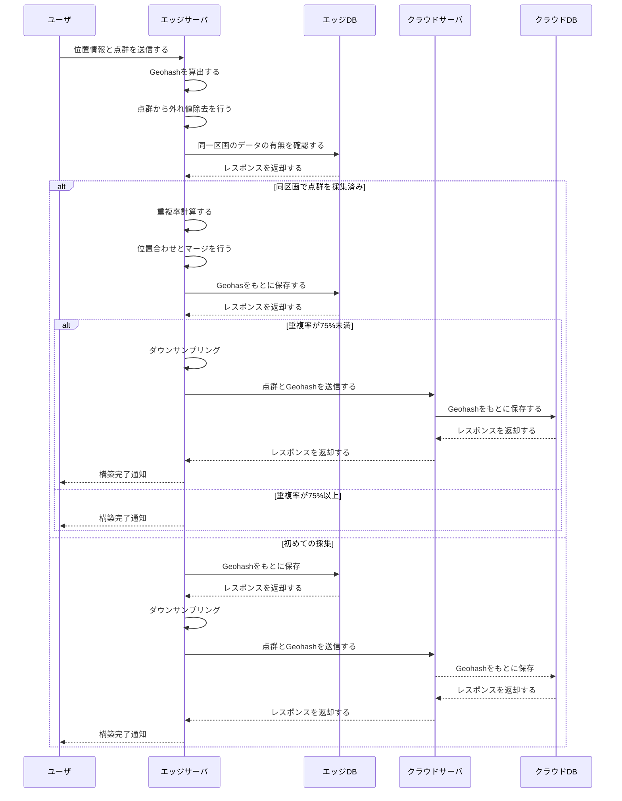

```mermaid
sequenceDiagram
    participant ユーザ
    participant エッジサーバ
    participant エッジDB
    participant クラウドサーバ
    participant クラウドDB

    ユーザ->>エッジサーバ:位置情報と点群を送信する
    エッジサーバ->>エッジサーバ: Geohashを算出する
    エッジサーバ->>エッジサーバ: 点群から外れ値除去を行う
    エッジサーバ->>エッジDB: 同一区画のデータの有無を確認する
    エッジDB-->>エッジサーバ: レスポンスを返却する
    alt 同区画で点群を採集済み
        エッジサーバ->>エッジサーバ: 重複率計算する
        エッジサーバ->>エッジサーバ: 位置合わせとマージを行う
        エッジサーバ->>エッジDB: Geohasをもとに保存する
        エッジDB-->>エッジサーバ: レスポンスを返却する
        alt 重複率が75%未満
            エッジサーバ->>エッジサーバ: ダウンサンプリング
            エッジサーバ->>クラウドサーバ: 点群とGeohashを送信する
            クラウドサーバ->>クラウドDB: Geohashをもとに保存する
            クラウドDB-->>クラウドサーバ: レスポンスを返却する
            クラウドサーバ-->>エッジサーバ: レスポンスを返却する
            エッジサーバ-->>ユーザ: 構築完了通知
        else 重複率が75%以上
            エッジサーバ-->>ユーザ: 構築完了通知
        end
    else 初めての採集
        エッジサーバ->>エッジDB: Geohashをもとに保存
        エッジDB-->>エッジサーバ: レスポンスを返却する
        エッジサーバ->>エッジサーバ: ダウンサンプリング
        エッジサーバ->>クラウドサーバ: 点群とGeohashを送信する
        クラウドサーバ-->>クラウドDB: Geohashをもとに保存
        クラウドDB-->>クラウドサーバ: レスポンスを返却する
        クラウドサーバ-->>エッジサーバ: レスポンスを返却する
        エッジサーバ-->>ユーザ: 構築完了通知
    end
```
