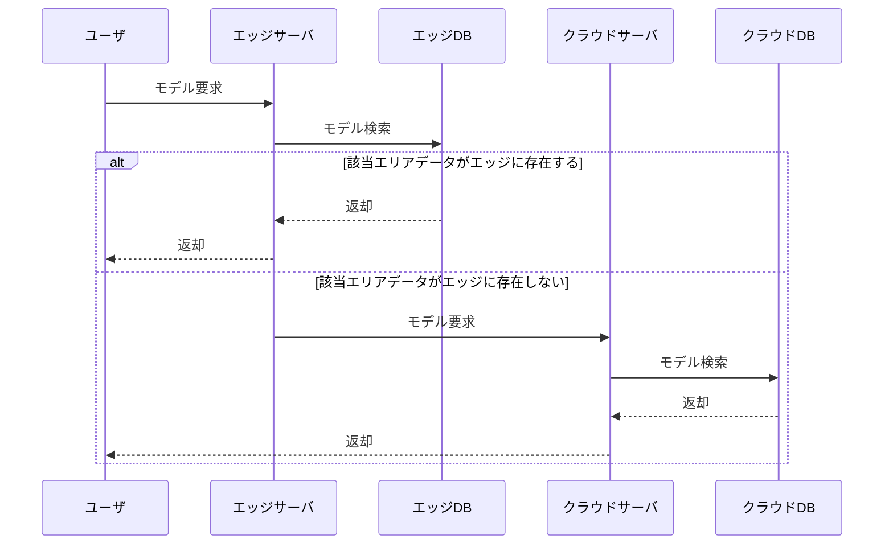

```mermaid
sequenceDiagram
    participant User        as ユーザ
    participant EdgeSrv    as エッジサーバ
    participant EdgeDB      as エッジDB
    participant CloudSrv    as クラウドサーバ
    participant CloudDB      as クラウドDB

    User->>EdgeSrv: モデル要求
    EdgeSrv->>EdgeDB: モデル検索
    alt 該当エリアデータがエッジに存在する
          EdgeDB-->>EdgeSrv: 返却
          EdgeSrv-->>User: 返却
      else 該当エリアデータがエッジに存在しない
          EdgeSrv->>CloudSrv: モデル要求
          CloudSrv->>CloudDB: モデル検索
          CloudDB-->>CloudSrv: 返却
          CloudSrv-->>User: 返却
      end
```
