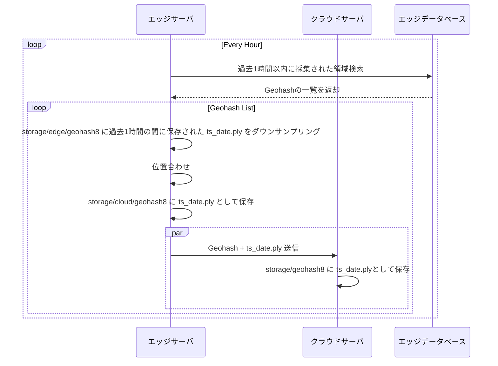

<!-- クラウドでの保存 -->

```mermaid
sequenceDiagram
    participant EdgeSrv    as エッジサーバ
    participant CloudSrv   as クラウドサーバ
    participant EdgeDB    as エッジデータベース

    loop Every Hour
        EdgeSrv->>EdgeDB: 過去1時間以内に採集された領域検索
        EdgeDB-->>EdgeSrv: Geohashの一覧を返却
        loop Geohash List
            EdgeSrv->>EdgeSrv: storage/edge/geohash8 に過去1時間の間に保存された ts_date.ply をダウンサンプリング
            EdgeSrv->>EdgeSrv: 位置合わせ
            EdgeSrv->>EdgeSrv: storage/cloud/geohash8 に ts_date.ply として保存
            par
                EdgeSrv->>CloudSrv: Geohash + ts_date.ply 送信
                CloudSrv->>CloudSrv: storage/geohash8 に ts_date.plyとして保存
            end
        end
    end
```
