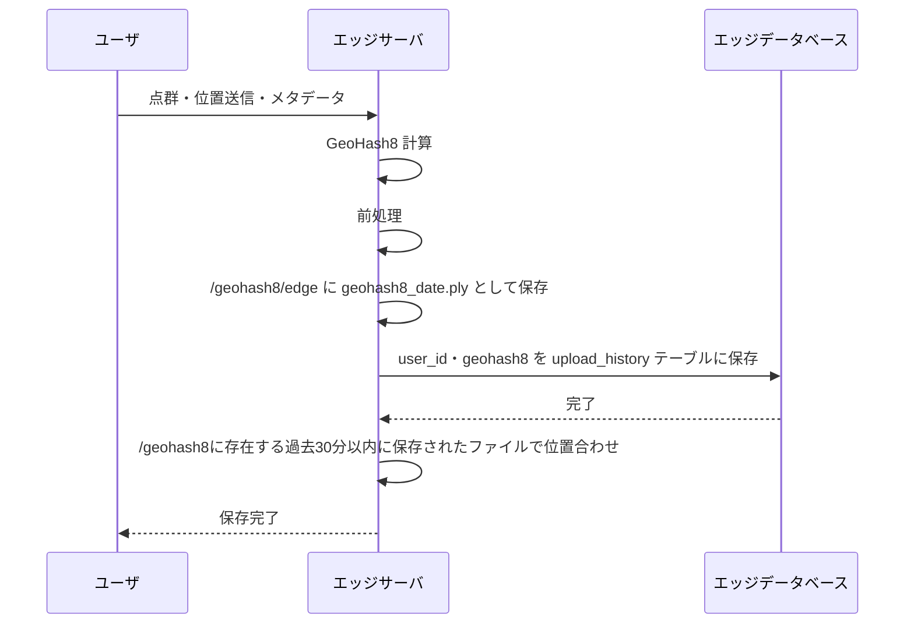

<!-- エッジでの保存 -->

```mermaid
sequenceDiagram
    participant User       as ユーザ
    participant EdgeSrv    as エッジサーバ
    participant EdgeDB     as エッジデータベース

    User->>EdgeSrv: 点群・位置送信・メタデータ

    EdgeSrv->>EdgeSrv: GeoHash8 計算
    EdgeSrv->>EdgeSrv: 前処理
    EdgeSrv->>EdgeSrv: /geohash8/edge に geohash8_date.ply として保存
    EdgeSrv->>EdgeDB: user_id・geohash8 を upload_history テーブルに保存
    EdgeDB-->>EdgeSrv: 完了
    EdgeSrv->>EdgeSrv: /geohash8に存在する過去30分以内に保存されたファイルで位置合わせ
    EdgeSrv-->>User: 保存完了
```
