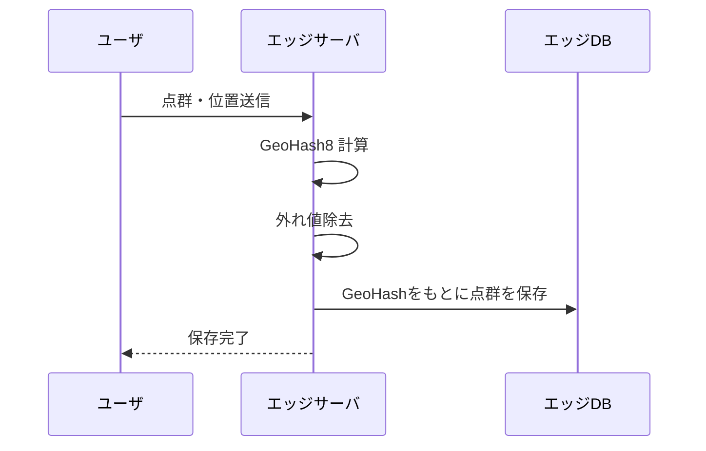

```mermaid
sequenceDiagram
    participant User        as ユーザ
    participant EdgeSrv    as エッジサーバ
    participant EdgeDB      as エッジDB

    User->>EdgeSrv: 点群・位置送信

    EdgeSrv->>EdgeSrv: GeoHash8 計算
    EdgeSrv->>EdgeSrv: 外れ値除去
    EdgeSrv->>EdgeDB: GeoHashをもとに点群を保存
    EdgeSrv-->>User: 保存完了
```
